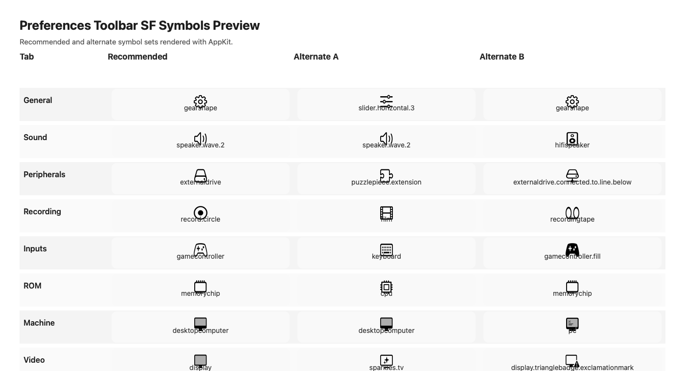

# Preferences Toolbar SF Symbols Preview

This is a quick preview sheet for possible SF Symbol replacements for the Preferences toolbar.

Visual preview image:

Open Apple's `SF Symbols` app and paste the symbol names below to compare them visually.

## Recommended Set

| Tab | Symbol | Why |
| --- | --- | --- |
| General | `gearshape` | Standard settings symbol, reads immediately as preferences. |
| Sound | `speaker.wave.2` | Clear audio/settings affordance. |
| Peripherals | `externaldrive` | Hardware-oriented and simple. |
| Recording | `record.circle` | Reads cleanly as capture/recording. |
| Inputs | `gamecontroller` | Closest available game-input symbol on the current macOS runtime. |
| ROM | `memorychip` | Best match for ROM/chip-related settings. |
| Machine | `desktopcomputer` | Clear machine/system representation. |
| Video | `display` | Simple and native-looking display symbol. |

## Alternate Set A: More Native / Settings-Oriented

| Tab | Symbol |
| --- | --- |
| General | `slider.horizontal.3` |
| Sound | `speaker.wave.2` |
| Peripherals | `puzzlepiece.extension` |
| Recording | `film` |
| Inputs | `keyboard` |
| ROM | `cpu` |
| Machine | `desktopcomputer` |
| Video | `sparkles.tv` |

## Alternate Set B: More Hardware-Oriented

| Tab | Symbol |
| --- | --- |
| General | `gearshape` |
| Sound | `hifispeaker` |
| Peripherals | `externaldrive.connected.to.line.below` |
| Recording | `recordingtape` |
| Inputs | `gamecontroller.fill` |
| ROM | `memorychip` |
| Machine | `pc` |
| Video | `display.trianglebadge.exclamationmark` |

## Best Alternates Per Tab

| Tab | Best Options |
| --- | --- |
| General | `gearshape`, `slider.horizontal.3`, `switch.2` |
| Sound | `speaker.wave.2`, `speaker.2`, `hifispeaker` |
| Peripherals | `externaldrive`, `puzzlepiece.extension`, `cpu` |
| Recording | `record.circle`, `film`, `recordingtape` |
| Inputs | `gamecontroller`, `keyboard`, `gamecontroller.fill` |
| ROM | `memorychip`, `cpu`, `opticaldiscdrive` |
| Machine | `desktopcomputer`, `pc`, `macwindow` |
| Video | `display`, `sparkles.tv`, `tv` |

## First Pass To Try In App

If we want the safest first visual pass, use:

- General: `gearshape`
- Sound: `speaker.wave.2`
- Peripherals: `externaldrive`
- Recording: `record.circle`
- Inputs: `gamecontroller`
- ROM: `memorychip`
- Machine: `desktopcomputer`
- Video: `display`

## Notes

- `gamecontroller` and `memorychip` are likely the strongest improvements over the current custom art.
- `Peripherals` is the least obvious category, so `externaldrive` is probably the safest choice.
- `record.circle` is the cleanest symbol visually, but `film` may fit better if this tab is more playback/media than capture.
- `display` is the most neutral `Video` icon; `sparkles.tv` is more stylized.
